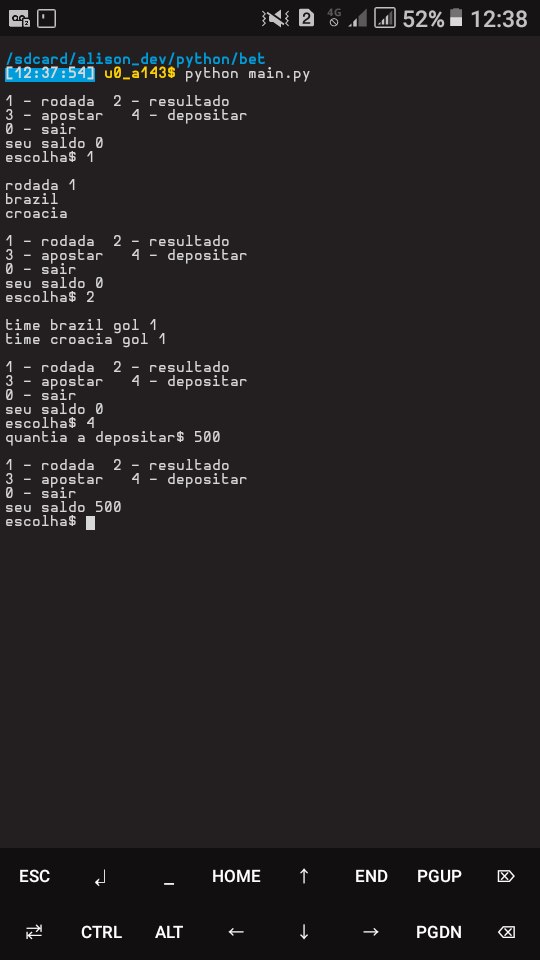

## Simulação de aposta esportiva

### Sobre o jogo
### Versao
versao 0.15  

Esse jogo foi desenvolvido com intuito de aperfeiçoar logica de programacao e python, então me dispus a criar esse programa de **CLI** *(interface de linha de comando)* na linguagem python.  
O jogo é baseado em uma simulação de apostas esportivas onde você poderá:
- Avançar para proxima rodada.
- Ver o resultado do jogo da rodada atual
- Apostar no jogo da rodada atual
- Depositar dinheiro para poder apostar.
### Funcionalidades
- RODADA
  - Sera avançado para proxima rodada, onde você poderá ver o resultado do jogo ou apostar no jogo da rodada atual.
- RESULTADO
  - Mostrará o resultado do jogo da rodada atual (só funcionará se você avançar a rodada).
- APOSTAR
  - Aqui você podera apostar a quantia (**Menor ou igual ao seu saldo**) no time (**Casa - Fora**) do jogo da rodada atual.
  - Atumaticamente quando você apostar a **QUANTIA** sera subtraida do seu **SALDO**.
  - Para saber se você ganhou é so chamar resultado, se você ganhou seu saldo irá aumentar o **valor da aposta + (valor da aposta / 2)**
  - Se perder não acotecerá nada.
  - Você pode apostar quantas vezes quiser no mesmo jogo da rodada atual.
- DEPOSITAR
  - Para depositar é necessario informar uma quantia maior que 0 (ZERO) e menor que o valor permitido (500) que sera acrescentada ao seu saldo de apostas.
## Sobre o código
Como esse projeto foi desenvolvido por motivos de aprendizagem, no codigo foram abordadas os seguintes temas:
> Codigo 100% escrito em python
- POO
- Herança
- Encapsulamento
- Decoradores de classe (@property)
- Condicionais
- Laços de Repeticões
- Estruturas de Dados
- E mais...
## Sobre mim
Eu sou um estudante de tecnologia e programação, atualmente focado em desenvolvimento web.

[Linkedin](https://www.linkedin.com/in/alison-silva-434972201)
[Facebook](https://www.facebook.com/diego.dev.94)

#### SE GOSTOU DO PROJETO DEIXA UMA ESTRELINHA AI ;)
